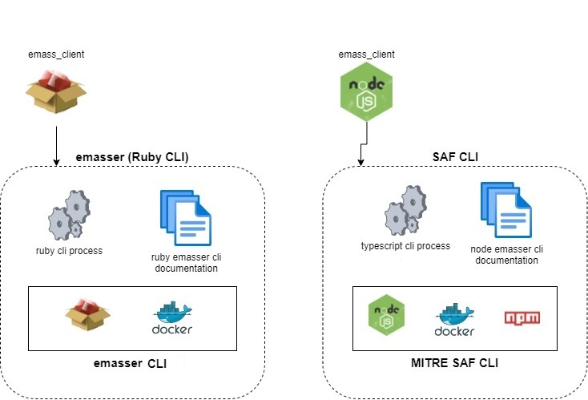

[](https://github.com/mitre/emass_client/actions/workflows/generate-clients.yml) [](https://github.com/mitre/emass_client/actions/workflows/generate_docs.yml) [](https://github.com/mitre/emass_client/actions/workflows/gh-pages.yml)

[](https://github.com/mitre/emasser/actions/workflows/codeql-analysis.yml) [](https://github.com/mitre/emasser/actions/workflows/test-ruby-client.yml) 

    

# eMASS Client
The eMASS client repository (```emass_client```) maintains the Enterprise Mission Assurance Support Service (eMASS) Representational State Transfer (REST) [Application Programming Interface (API) specifications](/docs/eMASS_API_Documentation.pdf) specification, and auto-generates API interfaces that allow application to interact with eMASS applications.


***NOTE***: A CLI application tool called [eMASSer](https://github.com/mitre/emasser), has been developed that makes use of the ```emass_client``` RubyGem. Additionally, the [SAF CLI](https://github.com/mitre/saf#emass-api-cli) implements the `emass_client` npm package.

# Highlights
## [eMASS API Specification](https://mitre.github.io/emass_client/docs/redoc/)
The eMASS API specification provides a broad understanding of how the API behaves and how the API links with an eMASS application instances. It explains how the API functions and the results to expect when using the API.

## [eMASS API Getting Started](/docs/eMASSGettingStarted.md)
Provides information on how to register external application that utilize the eMASS API to perform assessments and complete actions associated with system records. 
    .

## [eMASS API Viewer](https://mitre.github.io/emass_client/docs/renderer/)
Allows interaction with the API’s resources without having any of the implementation logic in place. A local mock servers cn also be used, please reference [Developers Instruction](docs/developers.md) on how to setup a local mock server.


# eMASS API Clients Generation Process
The executable packages (APIs) generated are used to access eMASS data and functionality by external third-party developers, business partners, or internal departments.

The following ```emass_client``` executable packages are generated by this repository:
- Ruby - The ruby package is hosted and available in the [RubyGems](https://rubygems.org/gems/emass_client). 

- Typescript - The typescript package is hosted and available in the [NpmRegistry](https://www.npmjs.com/package/@mitre/emass_client).
  
- Python - The python package is hosted and available in the [PyPIRegistry](https://pypi.org/manage/project/emass-client-api/releases/).

### How to Generate eMASS Clients
Generation of the API clients are accomplished by updating or modifying the eMASS API specification file `eMASSRestOpenApi.yaml`. Modification to this file triggers the clients' generation actions where all client packages are generated, and published to the appropriate repositories.

The preferable way to update the specification file is by forking this repository or creating a new branch in this repository followed by a Pull Request (PR), than making the necessary updates and [merged](https://docs.github.com/en/pull-requests/collaborating-with-pull-requests/incorporating-changes-from-a-pull-request/merging-a-pull-request) PR into the main branch.

The proper process for making client code updates are as follows:

- **Step 1** Update the eMASS API specification file `eMASSRestOpenApi.yaml`

- **Step 2** Make the necessary changes (update the version field) to the clients generation configuration files:
  - Ruby (src/openapi/templates/ruby/ruby-generator-config.json)
  - Typescript(src/openapi/templates/typescript/typescript-generator-config.json)
  - Python (src/openapi/templates/python/python-generator-config.json)
  
- **Step 3**
  Push the content to the repository
  
- **Step 4**
  Once all github actions finish and pass merge the pull request


### Generate Clients for Other Programming Languages
For detail information on how-to generating eMASS clients for additional programming languages reference [**Developers Instructions**](docs/developers.md)


## Repository Architecture
The process provided by this repository is depicted by the architecture diagram below. In a nutshell, it hosts the eMAASS API specification, documentation, interactive visualization tools, and generates clients for the following languages: `ruby`,  `typescript`, and `python`. 
<div align="center">
  
</div>

### Client Application
The ``emass_client`` executable packages can be included in other projects, or used to generate  CLI tools that require access to an eMASS instance as  demonstrated by the diagram below.
<div align="center">
  
</div>

## NOTICE

© 2020-2025 The MITRE Corporation.

Approved for Public Release; Distribution Unlimited. Case Number 18-3678.

## NOTICE

MITRE hereby grants express written permission to use, reproduce, distribute, modify, and otherwise leverage this software to the extent permitted by the licensed terms provided in the LICENSE.md file included with this project.

## NOTICE

This software was produced for the U. S. Government under Contract Number HHSM-500-2012-00008I, and is subject to Federal Acquisition Regulation Clause 52.227-14, Rights in Data-General.

No other use other than that granted to the U. S. Government, or to those acting on behalf of the U. S. Government under that Clause is authorized without the express written permission of The MITRE Corporation.

For further information, please contact The MITRE Corporation, Contracts Management Office, 7515 Colshire Drive, McLean, VA  22102-7539, (703) 983-6000.
