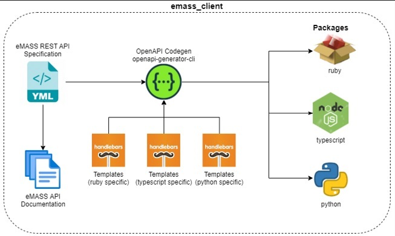

# eMASS Client
The eMASS client repository maintains the Enterprise Mission Assurance Support Service (eMASS) Representational State Transfer (REST) Application Programming Interface (API) documentation and executables. The executables packages currently provided are: RubyGem and TypeScript Node.

## [eMASS API Documentation](https://mitre.github.io/emass_client/docs/redoc/)
The eMASS API is documented in YAML and can be viewed utilizing a multitude of visualization tools. Included is a dependency-free (and nice looking) automated action that generates documentation in HTML using the [redoc-cli](https://www.npmjs.com/package/redoc-cli) command line tool.


## [Interactive eMASS API Documentation](https://mitre.github.io/emasse_client/docs/swagger/)
This repository provides interactive eMASS API documentation and lets users tryout the API calls directly in a browser via hosted or local mock servers. Please references [Developers Instruction](docs/developers.md) on how to setup a local mock server

## eMASS API Clients Generation Process
The executable packages (APIs) generated are used to access eMASS data and functionality by external third-party developers, business partners, or internal departments.

The following ```emass_client``` executable packages are generated by this repository:
- Ruby - The ruby package is hosted and available in the [RubyGems](https://rubygems.org). 

- Typescript - The typescript package is hosted and available in the [NpmRegistry](https://npmjs.com).

**Note**, there is an executable package called ```emasser```, this is a CLI tool that makes use of the ```emass_client```.

For detail information on how-to generating eMASS clients for other programming languages reference [**Developers Instructions**](docs/developers.md)


## Repository Architecture
The process provided by this repository is depicted by the architecture diagram below. In a nutshell, it provides the capability of hosting the eMAASS API documentation, generate interactive visualization and static/dynamic testing, and generate API clients for ```ruby``` and ```typescript``` languages. 



### Client Application
The ``emass_client`` packages can be included in other projects, or to generate a CLI that have a need to access an eMASS instance. This is demonstrated by the diagram below.


### NOTICE

© 2020 The MITRE Corporation.

Approved for Public Release; Distribution Unlimited. Case Number 18-3678.

### NOTICE

MITRE hereby grants express written permission to use, reproduce, distribute, modify, and otherwise leverage this software to the extent permitted by the licensed terms provided in the LICENSE.md file included with this project.

### NOTICE

This software was produced for the U. S. Government under Contract Number HHSM-500-2012-00008I, and is subject to Federal Acquisition Regulation Clause 52.227-14, Rights in Data-General.

No other use other than that granted to the U. S. Government, or to those acting on behalf of the U. S. Government under that Clause is authorized without the express written permission of The MITRE Corporation.

For further information, please contact The MITRE Corporation, Contracts Management Office, 7515 Colshire Drive, McLean, VA  22102-7539, (703) 983-6000.
